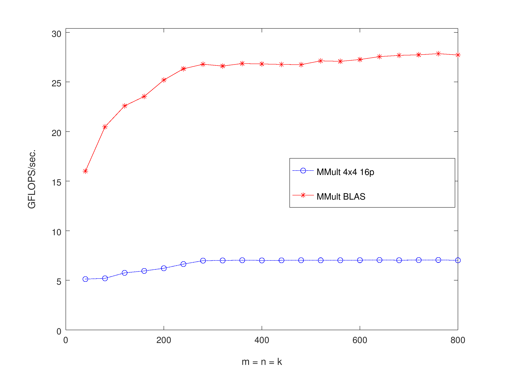

# GEMM Analysis

| Event                 | Reference      | MMult_4x4_16p  |
| --------------------- | -------------- | -------------- |
| Instructions          | 22,663,956,746 | 17,932,254,700 |
| L1-dcache-load-misses | 2,852,196,001  | 187,023,411    |

Both implementations issue close to the same number of instructions. This is
surprising as I would expect the optimized implementation to issue fewer
instruction because it uses more compact instructions (SSE instructions).

The difference in L1 cache misses is more in line with what I was expecting.
The optimized implementation blocks the input so that there is better locality.
With better locality, I expect fewer L1 cache misses.

### Optimized Portable Implementation vs BLAS

